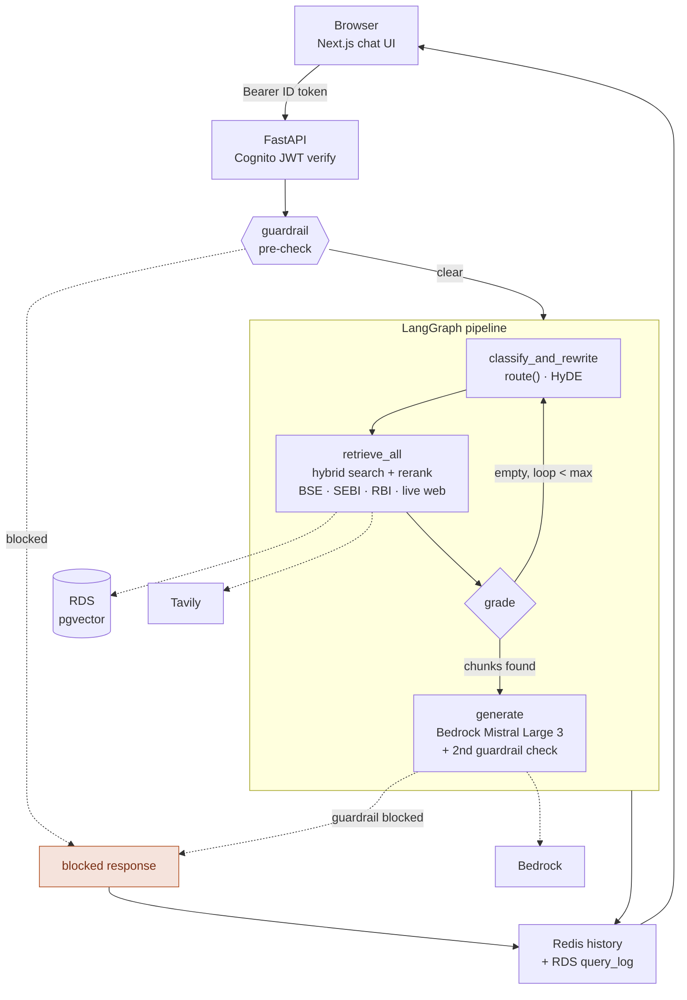

# Vyom (व्योम)

**Multi-source agentic RAG over Indian fintech data** — BSE/NSE filings, SEBI circulars, RBI macro data, and live web search, fused into one cited answer.


| **4** sources fused | **97** Nifty 100 companies | **0.84** RAGAS faithfulness | **100%** Terraform |
|---|---|---|---|

## What it does

> "HDFC Bank's annual report flags rising NPA risk in unsecured lending — what does RBI's latest policy say about the repo rate, and is there any current news that would affect this?"

A single-source RAG can't answer that — it needs a BSE filing, RBI macro data, *and* a live web search, fused into one cited answer. Vyom routes each query to the right source(s), retrieves, and answers only from what it actually found — with inline citations back to the exact filing, circular, series, or web result.

## Screenshots

| | |
|---|---|
|  *Cited, grounded answer* |  *Per-user conversation history* |
|  *Live routing rationale* |  *Prompt-injection caught* |

*(placeholders — drop PNGs into `docs/screenshots/`)*

## Architecture



## Engineering highlights

- **Root-caused a Terraform state-reconciliation bug in production** — mixing inline `ingress` blocks with a separate `aws_security_group_rule` caused every `apply` to silently delete the EC2→RDS access rule. Caught it via the health-check metric's own history.
- **Diagnosed an LLM citation-hallucination bug** — the model copied a literal example citation tag from its own system prompt when no matching source existed, because the example's index looked like a real one. Fixed with an explicit anti-hallucination instruction.
- **Debugged a guardrail false-positive cascade** — a blocked response's refusal text, once stored in history, kept re-triggering the injection classifier on later turns from prompt *shape* alone, independent of content. Fixed the storage layer and rescoped which calls need guardrail screening.

## Tech stack

| Layer | Technology |
|---|---|
| Orchestration | LangGraph |
| API | FastAPI (nginx + systemd on EC2) |
| Database / cache | PostgreSQL + pgvector (RDS) · Redis (ElastiCache) |
| Generation / guardrails | Amazon Bedrock — Mistral Large 3 + Guardrails |
| Embedding / reranking | `nomic-embed-text-v1.5` · `bge-reranker-v2-m3` (local) |
| Live search | Tavily |
| Auth | Amazon Cognito |
| Frontend | Next.js 16, React 19, TypeScript, Tailwind |
| Evaluation | RAGAS + MLflow |
| Infra / observability | Terraform · CloudWatch (logs, alarms, dashboard) |

## Evaluation

RAGAS on a 25-question golden set (single-turn + multi-turn):

| Faithfulness | Answer relevancy | Context precision | Context recall |
|---|---|---|---|
| 0.84 | 0.79 | 0.33 | 0.44 |

## Running locally

```bash
cp .env.example .env && docker compose up -d
pip install -e ".[api,cloud,local]"
uvicorn src.vyom.api.app:app --reload

cd frontend && npm install && npm run dev
```

Deployment is fully Terraform-managed — see `infra/main.tf`.

## Author

**[Anand09-in](https://github.com/Anand09-in)**

## License

[MIT](LICENSE)
